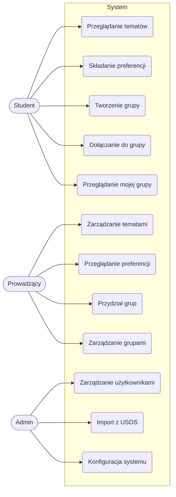

# Analiza wymagań - Aplikacja Webowa do Obsługi Projektu Grupowego

## 📋 Plan
- ✅ Analiza wymagań w projektach IT 
- ✅ Warsztat: identyfikacja interesariuszy
- ✅ Przygotowanie listy wymagań funkcjonalnych
- ✅ Warsztat: przypadki użycia
- ✅ Opis wymagań niefunkcjonalnych
- ✅ Prezentacja przygotowanych dokumentów
- ✅ Podsumowanie i refleksja

**Efekt**: ✅ **dokument Specyfikacja wymagań funkcjonalnych i niefunkcjonalnych**.

---

## 1. Analiza wymagań

### 1.1. Definicja projektu
Aplikacja webowa do kompleksowej obsługi przedmiotu "Projekt Grupowy" na Politechnice Warszawskiej. System zastępuje manualne procesy zarządzania projektami grupowymi poprzez cyfryzację całego workflow.

### 1.2. Faktyczny zakres projektu (na podstawie kodu):
- **Backend**: Django REST API z 4 głównymi aplikacjami
- **Frontend**: Single Page Application w Vue.js
- **Autoryzacja**: 3-poziomowy system ról (student, lecturer, admin)
- **Integracje**: Import danych z USOS (plik CSV)

### 1.3. Kluczowe punkty analizy wymagań:
1. **Definicja**: Analiza wymagań to proces odkrywania, dokumentowania i uzgadniania tego, co system ma robić (wymagania funkcjonalne) oraz jak ma działać (wymagania niefunkcjonalne).
2. **Cel**: Zminimalizowanie ryzyka nieporozumień między zespołem projektowym a interesariuszami (studentami, prowadzącymi, administracją).
3. **Znaczenie**: Dobrze zdefiniowane wymagania to fundament projektu – błędy na tym etapie są najdroższe do naprawienia.

### 1.4. Etapy analizy dla tego projektu:
1. **Identyfikacja interesariuszy** – studenci, prowadzący, administratorzy, dziekanat
2. **Zbieranie wymagań** – analiza istniejących procesów papierowych, wywiady z prowadzącymi
3. **Dokumentowanie** – specyfikacja wymagań, przypadki użycia, diagramy
4. **Walidacja** – prototypowanie, sesje z użytkownikami

---
## 2. 🧩 Identyfikacja interesariuszy

### Lista ról i ich potrzeb (na podstawie modeli Django):

| Rola | Model w systemie | Główne potrzeby | Priorytet |
|------|-----------------|-----------------|-----------|
| **Student** | `User(is_student=True)` | Przeglądanie tematów, wybór preferencji, formowanie grup, komunikacja | Wysoki |
| **Prowadzący** | `User(is_lecturer=True)` | Zarządzanie tematami, przydział grup, ocenianie | Wysoki |
| **Administrator** | `User(is_staff=True)` | Zarządzanie użytkownikami, konfiguracja systemu | Średni |

### Szczegółowe potrzeby:

**Student (z modelu `users/models.py`):**
- Możliwość logowania się do systemu
- Przeglądanie listy dostępnych tematów (`/api/topics/`)
- Składanie preferencji tematycznych (1-3 priorytet) (`/api/preferences/`)
- Formowanie/dołączanie do grup projektowych (`/api/groups/`)
- Przeglądanie przydzielonego tematu i grupy

**Prowadzący (Lecturer):**
- Tworzenie i edycja tematów projektowych (`Topic` model)
- Przeglądanie preferencji studentów
- Przydział tematów do grup

**Administrator:**
- Import użytkowników z USOS (skrypt `makeusers.py`)
- Zarządzanie kontami użytkowników
- Konfiguracja parametrów systemu
- Backup i przywracanie danych
- Monitoring aktywności systemu

---
## 3. 📑 Wymagania funkcjonalne

### 3.1. Lista wymagań w formie tabelarycznej:

| ID | Opis wymagania | Priorytet | Źródło (plik) | Status |
|----|----------------|-----------|---------------|--------|
| **F1** | System musi umożliwiać logowanie użytkowników z rolą (student/lecturer/admin) | Must | `users/models.py` | ✅ |
| **F2** | Student może przeglądać listę dostępnych tematów projektowych | Must | `topics/views.py` | ✅ |
| **F3** | Student może składać preferencje tematyczne (ranking 1-3) | Must | `preferences/models.py` | ✅ |
| **F4** | Prowadzący może tworzyć i edytować tematy projektowe | Must | `topics/views.py` | ✅ |
| **F6** | Student może utworzyć nową grupę projektową | Must | `groups/views.py` | ✅ |
| **F7** | Student może dołączyć do istniejącej grupy | Must | `groups/views.py` | ✅ |
| **F8** | Prowadzący może przydzielić temat grupie | Must | `groups/models.py` | ✅ |
| **F9** | System umożliwia import użytkowników z pliku CSV (USOS) | Could | `makeusers.py` | ✅ |
| **F10** | Administrator może zarządzać wszystkimi użytkownikami | Should | `users/admin.py` | ✅ |
| **F11** | System wyświetla różne widoki w zależności od roli użytkownika | Must | `permission.py` | ✅ |
| **F12** | Student może zobaczyć swój przydzielony temat i grupę | Must | Frontend components | ✅ |
| **F13** | Prowadzący może zobaczyć listę wszystkich grup | Must | `GroupsTable.vue` | ✅ |

### 3.2. User Stories:

**Jako student:**
- "Jako student, chcę się zalogować, aby uzyskać dostęp do systemu" (`Login.vue`)
- "Jako student, chcę przeglądać dostępne tematy, aby wybrać interesujący mnie projekt" (`TopicsTable.vue`)
- "Jako student, chcę ustawić preferencje tematyczne, aby zwiększyć szanse na otrzymanie preferowanego tematu" 
- "Jako student, chcę utworzyć grupę projektową, aby pracować nad projektem z kolegami" (`GroupsForm.vue`)
- "Jako student, chcę dołączyć do istniejącej grupy, jeśli nie mam własnego zespołu"

**Jako prowadzący:**
- "Jako prowadzący, chcę dodawać nowe tematy projektowe, aby zapewnić różnorodność wyboru" (`TopicsForm.vue`)
- "Jako prowadzący, chcę zarządzać grupami studentów, aby zapewnić prawidłowy podział" (`GroupsTable.vue`)
- "Jako prowadzący, chcę przydzielać tematy grupom, aby rozpocząć pracę projektową"

**Jako administrator:**
- "Jako administrator, chcę importować użytkowników z USOS, aby zaoszczędzić czas na ręczne wpisywanie"
- "Jako administrator, chcę zarządzać uprawnieniami użytkowników, aby zapewnić bezpieczeństwo systemu"

### 3.3. Przypadki użycia:
**Przypadek użycia: "Składanie preferencji tematycznych"**
- **Aktor**: Student
- **Warunki początkowe**: Student jest zalogowany, są dostępne tematy
- **Scenariusz główny**:
  1. Student wybiera "Preferencje" z menu
  2. System wyświetla listę dostępnych tematów
  3. Student przypisuje priorytety (1-najwyższy, 3-najniższy)
  4. Student zapisuje preferencje
  5. System waliduje unikalność priorytetów
- **Scenariusz alternatywny**: Brak dostępnych tematów → system wyświetla komunikat

**Przypadek użycia: "Tworzenie grupy projektowej"**
- **Aktor**: Student
- **Warunki początkowe**: Student jest zalogowany, nie należy do żadnej grupy
- **Scenariusz główny**:
  1. Student wybiera "Utwórz grupę"
  2. Student podaje nazwę grupy
  3. System tworzy grupę
  4. System wyświetla kod dostępu do grupy
- **Scenariusze alternatywne**:
  - Student już należy do grupy → system blokuje tworzenie nowej
  - Nazwa grupy już istnieje → system prosi o inną nazwę

---
## 4. 🛠️ Diagram przypadków użycia (Use Case Diagram)

### 4.1. Główne akty i przypadki użycia:

### 4.2. Relacje między przypadkami użycia:
- `«include»`: "Przydział grup" includes "Walidacja dostępności tematów"
- `«extend»`: "Tworzenie grupy" może zostać rozszerzone o "Generowanie kodu dostępu"
- **Generalizacja**: `Użytkownik` ← `Student`, `Lecturer`, `Admin`

## 5. 🔒 Wymagania niefunkcjonalne

### 5.1. Bezpieczeństwo
| Wymaganie | Opis | Implementacja w kodzie |
|-----------|------|------------------------|
| **NF1** | Autoryzacja oparta na rolach | `permissions.py` - custom permissions |
| **NF2** | Walidacja danych wejściowych | Django ModelForms, serializers |
| **NF3** | Ochrona przed atakami CSRF | Django CSRF middleware |
| **NF4** | Bezpieczne przechowywanie haseł | Django Password hashers (bcrypt) |
| **NF5** | Logowanie operacji administracyjnych | Django admin log entries |

### 5.2. Wydajność
| Wymaganie | Opis | Wymagany poziom |
|-----------|------|-----------------|
| **NF6** | Czas odpowiedzi API | < 2 sekundy dla 95% zapytań |
| **NF7** | Obsługa równoczesnych użytkowników | 200 studentów + 5 prowadzących |
| **NF8** | Czas ładowania strony głównej | < 3 sekundy |
| **NF9** | Skalowalność baza danych | Obsługa do 500 użytkowników |

### 5.3. Dostępność
| Wymaganie | Opis | Status |
|-----------|------|--------|
| **NF10** | Dostępność systemu | 99% w godzinach pracy (8-20) |
| **NF11** | Kompatybilność przeglądarek | Chrome, Firefox, Edge |
| **NF12** | Responsywność interfejsu | Mobile, tablet, desktop (Vuetify) |
| **NF13** | Backup danych | Raz w tygodniu |

### 5.4. Użyteczność
| Wymaganie | Opis | Implementacja |
|-----------|------|---------------|
| **NF14** | Intuicyjny interfejs | Vuetify Material Design |
| **NF15** | Polska lokalizacja | Wszystkie komunikaty po polsku |
| **NF16** | Komunikaty błędów | Czytelne komunikaty dla użytkowników |
| **NF17** | Pomoc kontekstowa | Tooltips w interfejsie |

### 5.5. Integracja
| Wymaganie | Opis | Status |
|-----------|------|--------|
| **NF18** | Import z USOS | CSV import (`makeusers.py`) |
| **NF19** | REST API | Django REST Framework |
| **NF20** | Format danych | JSON dla API, CSV dla importu |

## 6. 📊 Checklist dla wymagań niefunkcjonalnych

### 🔒 **Bezpieczeństwo**
- [x] Autoryzacja oparta na rolach
- [x] Walidacja danych wejściowych
- [x] Ochrona przed CSRF (Django)
- [x] Hashowanie haseł
- [ ] HTTPS/SSL (do wdrożenia)

### ⚡ **Wydajność**
- [x] Optymalne zapytania do bazy (Django ORM)
- [ ] Cache'owanie danych (do implementacji)
- [x] Paginacja list
- [ ] Minifikacja assets (do implementacji)

### 🌐 **Dostępność**
- [x] Responsywny design (Vuetify)
- [x] Kompatybilność z przeglądarkami
- [ ] Monitoring (do wdrożenia)
- [ ] Backup (do zautomatyzowania)

### 🎨 **Użyteczność**
- [x] Spójny design system
- [x] Polska lokalizacja
- [x] Komunikaty błędów po polsku
- [ ] Dokumentacja użytkownika (do przygotowania)

### 🔄 **Integracja**
- [x] RESTful API
- [x] Import z CSV (USOS)
- [ ] Eksport danych (do implementacji)
- [ ] Powiadomienia email (do implementacji)

## 7. 🎯 Podsumowanie i refleksja

### 7.1. Stan obecny projektu:
✅ **Zaimplementowane:**
- System autoryzacji z 3 rolami
- Zarządzanie tematami projektowymi
- System preferencji studentów
- Formowanie grup projektowych
- Import użytkowników z USOS
- Responsywny frontend w Vue.js

🔄 **Do rozwinięcia:**
- System oceniania projektów
- Zaawansowane algorytmy przydziału
- System komunikacji wewnętrznej
- Raporty i statystyki
- Dokumentacja API

### 7.2. Wnioski z analizy wymagań:
1. **Sukces**: System dobrze rozwiązuje podstawowe problemy zarządzania projektami
2. **Wyzwania**: Algorytm przydziału tematów wymaga optymalizacji
3. **Rekomendacje**:
   - Dodanie powiadomień email
   - Implementacja systemu oceniania
   - Testy integracyjne
   - Dokumentacja użytkownika

### 7.3. Wartość dla użytkowników:
- **Dla studentów**: Transparentny proces przydziału tematów
- **Dla prowadzących**: Automatyzacja pracy administracyjnej
- **Dla administracji**: Centralizacja danych projektowych

---

## 8. 📁 Załączniki

### 8.1. Struktura API:
- `GET /api/topics/` - lista tematów
- `POST /api/preferences/` - składanie preferencji
- `GET /api/groups/` - zarządzanie grupami
- `POST /api/auth/login/` - logowanie

### 8.2. Technologie:
- **Backend**: Django 3.2, Django REST Framework, SQLite
- **Frontend**: Vue.js 2, Vue Router, Vuetify, Axios
- **Narzędzia**: Git, pip, npm

---

## 📅 Informacje o dokumencie
- **Data**: 2025-12-07
- **Autor**: Mateusz Rutkowski
- **Przedmiot**: Projekt Grupowy
- **Uczelnia**: WSPA
- **Wersja**: 1.0
